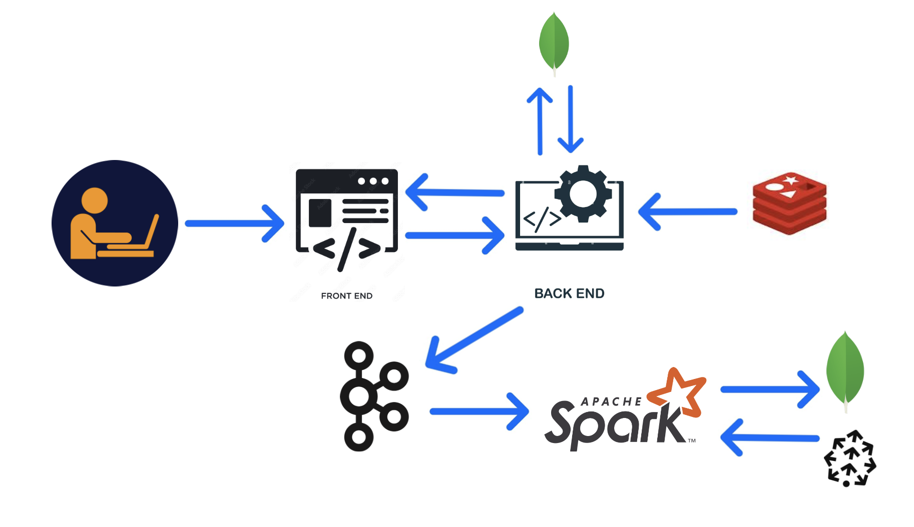
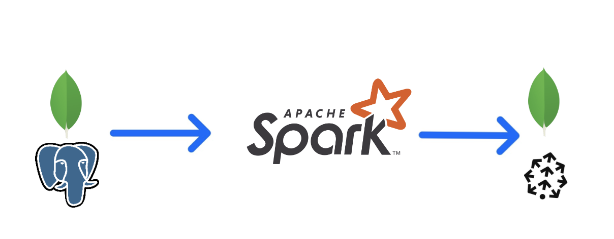
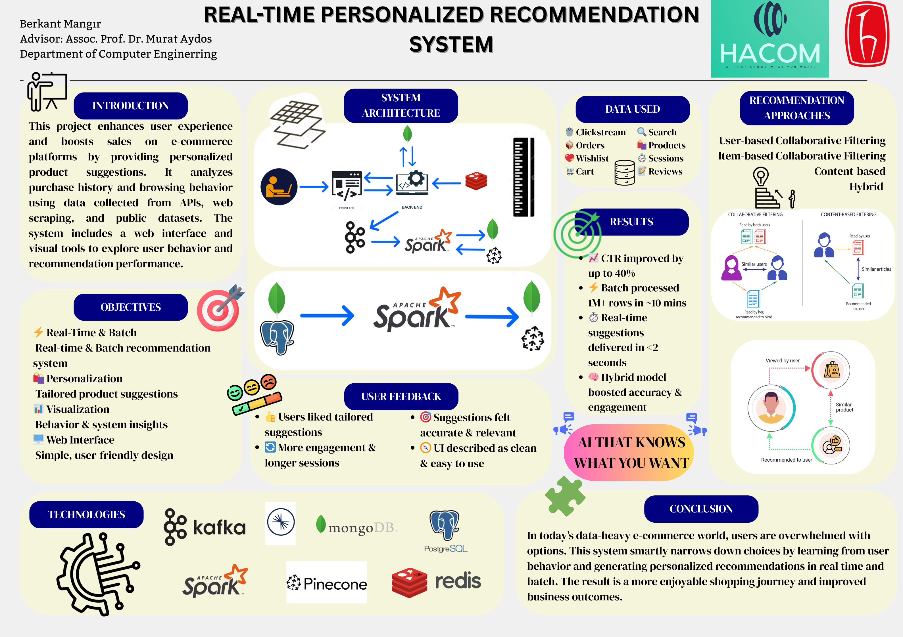

# 🧠 Real-Time Personalized Recommendation System for E-commerce

This project aims to enhance user experience and boost sales in e-commerce platforms by providing personalized product recommendations using both batch-time and real-time processing. By analyzing user behavior—including browsing, purchasing, and wishlist activity—the system intelligently suggests products users are likely to buy, even before they search for them.

> “AI that knows what you want.”

---

## 🚀 Key Features

- ⚡ **Real-Time & Batch Recommendations**  
  Combines real-time streaming with nightly batch processing to provide up-to-date suggestions.

- 🛍 **Hybrid Recommendation Models**  
  - User-based Collaborative Filtering (UBCF)  
  - Item-based Collaborative Filtering (IBCF)  
  - Content-based Filtering  
  - Heuristic models (Trending, Reviewed, Bought Together, etc.)

- 🔍 **Gemini-Powered Search Interface**  
  The search experience is enhanced with Google's Gemini model, offering smarter and more context-aware product search results.

- 📈 **Improved Click-Through Rate**  
  - CTR improved by up to **40%**
  - Real-time suggestions in **< 2 seconds**

- 💻 **Web Interface**  
  Frontend for displaying personalized recommendations using a user-friendly layout.

- 🔄 **High Performance & Scalability**  
  - 84.6 req/sec
  - Average response: 13ms
  - Redis caching (99.9% hit rate)

---

## 🧱 System Architecture

> GCP Dataproc (Apache Spark) handles batch jobs.  
> Kafka + Spark Streaming handles real-time data every 3 minutes.  
> Recommendations are cached in Redis and fetched via Flask API.  
> Gemini enhances semantic understanding of search queries.

> Batch processing runs nightly on GCP Dataproc to update recommendation models and generate new suggestions.
> Data is processed using Apache Spark and stored in MongoDB for quick retrieval. 
> Batch jobs handle heavy computations like matrix factorization and model training.
---

## 🛠 Technologies Used

- **Backend**: Python (Flask), MongoDB, PostgreSQL, Redis, Pinecone
- **Frontend**: HTML/CSS + JS (Render.com hosted)
- **Search Engine**: Gemini (semantic product search)
- **Streaming & Batch Processing**: Apache Spark (PySpark), Kafka, GCP Dataproc
- **Monitoring**: Prometheus, Apache JMeter
- **Deployment**: GCP, Render

---

## 📊 Data Sources

- Clickstream (browsing behavior)
- Orders & Cart additions
- Wishlists
- Product reviews
- Synthetic dataset enriched via scraping & simulated APIs

---

## 🧪 Performance & Scalability

| Metric                   | Value                      |
|--------------------------|----------------------------|
| Avg Throughput           | 84.6 req/sec               |
| Avg Response Time        | 13 ms                      |
| Cache Hit Rate (Redis)   | 99.9%                      |
| Concurrent Users Tested  | 500+                       |
| Error Rate               | 0%                         |
| Uptime                   | 100% (during load tests)   |

> 🔄 **Latency < 5ms for 99.5% of requests**

---

## 🖼 Poster

Here is a visual summary of the project:

---

## 📈 Future Improvements

- Integrate HDFS for scalable clickstream storage  
- Enhance data quality with richer behavioral signals (e.g., dwell time, scroll depth)  
- Add deep learning models (e.g., Neural Collaborative Filtering, Transformers)  
- Implement A/B testing and feedback loops for continuous learning  
- Improve cold-start strategies for new users/products

---

## 🧑‍💻 Project Team

**Berkant Mangır**  
Advisor: Assoc. Prof. Dr. Murat Aydos  
Department of Computer Engineering

---

## 📬 Contact

For questions, reach out via [email/contact method if you'd like].
